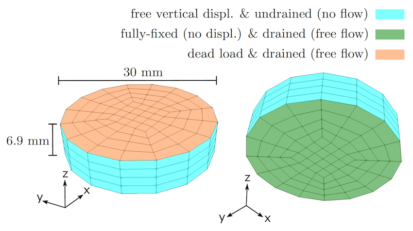
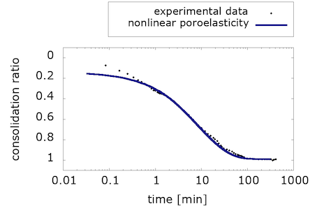
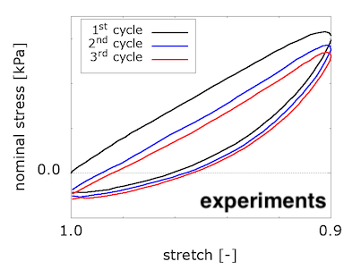
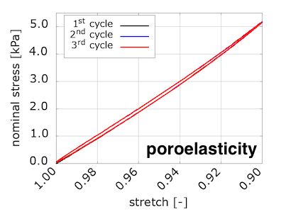
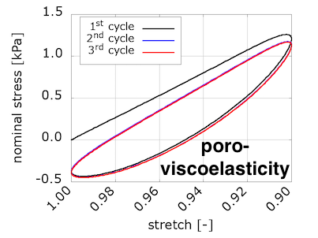
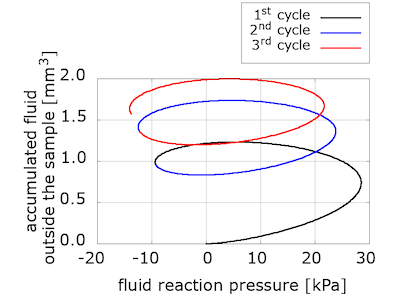
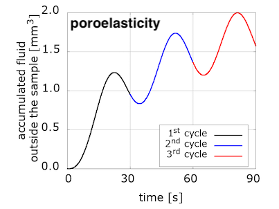
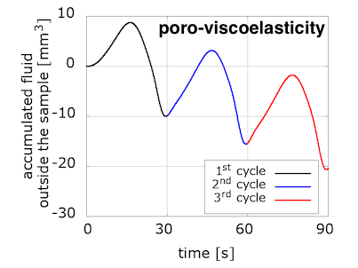
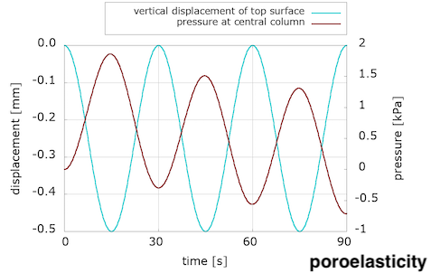
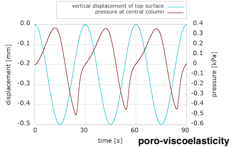

Readme file for nonlinear-poro-viscoelasticity
==============================================

Overview
--------
We implemented a nonlinear poro-viscoelastic formulation with the aim of characterising brain tissue response to cyclic loading. Our model captures both experimentally observed fluid flow and conditioning aspects of brain tissue behavior in addition to its well-established nonlinear, preconditioning, hysteretic, and tension-compression asymmetric characteristics.

The tissue is modelled as a biphasic material consisting of an immiscible aggregate of a nonlinear viscoelastic solid skeleton saturated with pore fluid. The governing equations are linearised using automatic differentiation and solved monolithically for the unknown solid displacements and fluid pore pressure values. 

A detailed description of the formulation, its verification, and the results obtained can be found in:
<ul>
  <li>E. Comellas, S. Budday, J.-P. Pelteret, G. A. Holzapfel and P. Steinmann (2020), Modeling the porous and viscous responses of human brain tissue behavior, Computer Methods in Applied Mechanics and Engineering, 113128. DOI: [10.1016/j.cma.2020.113128](https://doi.org/10.1016/j.cma.2020.113128). </li>
</ul>

In this paper we show that nonlinear poroelasticity alone can reproduce consolidation experiments, yet it is insufficient to capture stress conditioning due to cyclic loading. We also discuss how the poroelastic response exhibits preconditioning and hysteresis in the fluid flow space, with porous and viscous effects being highly interrelated.


Quick facts about the code
--------------------------
<ul>
  <li>Biphasic material following the Theory of Porous Media </li>
  <li>Nonlinear finite viscoelasticity built on Ogden hyperelasticity </li>
  <li>Darcy-like fluid flow </li>
  <li>Spatial discretisation with continuous Q2-P1 Lagrangian finite elements </li>
  <li>Temporal discretisation with a stable implicit one-step backward differentiation method </li>
  <li>Newton-Raphson scheme to solve the nonlinear system of governing equations </li>
  <li>Forward mode automatic differentiation with the number of derivative components chosen at run-time (Sacado library within Trilinos package) to linearise the governing equations (and, implicitly, the constitutive laws) </li>
  <li>Trilinos direct solver for the (non-symmetric) linear system of equations using a monolithic scheme </li>
  <li>Parallelization through Threading Building Blocks and across nodes via MPI (using Trilinos linear algebra) </li>
  <li>Based on step-44 and the code gallery contributions 'Quasi-Static Finite-Strain Compressible Elasticity' and 'Quasi-Static Finite-Strain Quasi-incompressible Visco-elasticity' </li>
  <li>Only works in 3D </li>
</ul>


Running the code
---------------- 
### Requirements
<ul>
  <li>MPI and Trilinos (built with the Sacado library) must be enabled </li>
</ul>

### Compiling and running
Similar to the example programs, run
```
cmake -DDEAL_II_DIR=/path/to/deal.II .
```
in this directory to configure the problem.  
You can switch between debug and release mode by calling either
```
make debug
```
or
```
make release
```
The problem may then be run in serial mode with
```
make run
```
and in parallel (in this case, on `6` processors) with
```
mpirun -np 6 ./nonlinear-poro-viscoelasticity
```

Alternatively, to keep it a bit more tidy, create a folder, e.g. run and copy the input file in there. Then type:
```
mpirun -np 6 -wdir run ../nonlinear-poro-viscoelasticity
```
All the input files used to produce the results shown in the paper are provided in in the input-files folder. Simply replace the parameters.prm file in the main directory. For the verification examples, run the python script 'run-multi-calc.py' instead:
```
python run-multi-calc.py
```
The 'run-multi-calc.py' and 'runPoro.sh' files provided must both be in the main directory. This will automatically generate the required input files and run them in sequence.


Reference for this work
-----------------------
If you use this program as a basis for your own work, please consider citing the paper referenced in the introduction. The initial version of this work was contributed to the deal.II project by E. Comellas and J-P. Pelteret.


Recommended literature
----------------------
<ul>
  <li>W. Ehlers and G. Eipper (1999), Finite Elastic Deformations in Liquid-Saturated and Empty Porous Solids, Transport in Porous Media 34(1/3):179-191. DOI: [10.1023/A:1006565509095](https://doi.org/10.1023/A:1006565509095). </li>
  <li>S. Reese and  S. Govindjee (2001), A theory of finite viscoelasticity and numerical aspects, International Journal of Solids and Structures 35(26-27):3455-3482. DOI: [10.1016/S0020-7683(97)00217-5](https://doi.org/10.1016/S0020-7683(97)00217-5). </li>
  <li>G. Franceschini, D. Bigoni, P. Regitnig and G. A. Holzapfel (2006), Brain tissue deforms similarly to  filled elastomers and follows consolidation theory, Journal of the Mechanics and Physics of Solids 54(12):2592-2620. DOI: [10.1016/j.jmps.2006.05.004](https://doi.org/10.1016/j.jmps.2006.05.004). </li>
  <li>S. Budday, G. Sommer, J. Haybaeck, P. Steinmann, G. A. Holzapfel and E. Kuhl (2017), Rheological characterization of human brain tissue, Acta Biomaterialia 60:315-329. DOI: [10.1016/j.actbio.2017.06.024](https://doi.org/10.1016/j.actbio.2017.06.024). </li>
  <li>G.A. Holzapfel (2001), Nonlinear Solid Mechanics. A Continuum Approach for Engineering, John Wiley & Sons. ISBN: [978-0-471-82319-3](http://eu.wiley.com/WileyCDA/WileyTitle/productCd-0471823198.html). </li>
</ul>


Results
----------------------
The results shown here are a selection of those presented and discussed in the paper referenced in the introduction.

### Consolidation experiments
We reproduce the uniaxial consolidation experiments of brain tissue from the seminal paper by Franceschini et al. (2006) using a reduction of our formulation to nonlinear poroelasticity without the viscous component. The following geometry (320 cells and 9544 degrees of freedom), boundary conditions, and loading are used:



The material properties are:
<ul>
  <li>First Lamé parameter: 334kPa </li>
  <li>Ogden parameters:  μ<sub>1</sub>=1.044kPa,  μ<sub>2</sub>=1.183kPa, α<sub>1</sub>=4.309, and α<sub>2</sub>=7.736 </li>
  <li>Initial solid volume fraction: 0.80 </li>
  <li>Isotropic initial intrinsic permeability: 8.0e-11mm<sup>2</sup> </li>
  <li>Deformation-dependency control parameter for the permeability: 40 </li>
  <li>Fluid viscosity: 0.89mPa·s </li>
</ul>

We consider the effect of gravity in our formulation, with the simplifying assumption that the fluid and solid density are both 0.997mg/mm<sup>3</sup>. Using these parameters and simulation conditions, we obtain a reasonable fit to the experimental curve:



What is interesting about these results is that they show that nonlinear poroelasticity alone, i.e. with a purely hyperelastic solid component, can capture the consolidation behavior of brain tissue in response to an [oedometric test](https://en.wikipedia.org/wiki/Oedometer_test). However, as we will see in the next section, the viscous component is necessary to also capture stress conditioning due to cyclic loading.


### Cyclic experiments under multiple loading modes
Budday et al. (2017) performed an exhaustive set of cyclic loading experiments on brain tissue. They showed in this and subsequent publications that a finite viscoelastic Ogden model is able to predict essential features like nonlinearity, preconditioning, hysteresis, and tension-compression asymmetry. However, such a monophasic viscoelastic formulation can only implicitly capture the effects due to the extracellular fluid flow within the tissue. This was the motivation behind the formulation presented here: to provide a comprehensive  model for brain tissue response that will enable us to explore the porous and viscous effects in its mechanical response to a wide range of loading scenarios. 

As an example, we show here the results for cyclic compressive loading. The following geometry (512 cells and 15468 degrees of freedom), boundary conditions, and loading are used:


The material properties are:
<ul>
  <li>First Lamé parameter: 24.5kPa </li>
  <li>Ogden hyperelastic parameters: μ<sub>∞,1</sub>=-83.9Pa, and α<sub>∞,1</sub>=-11.92 </li>
  <li>Ogden viscous parameters: μ<sub>1</sub>=-2100Pa, and α<sub>1</sub>=-2.2 </li>
  <li>Deformation-independent viscosity of the solid: 14kPa·s </li>
  <li>Initial solid volume fraction: 0.75 </li>
  <li>Isotropic initial intrinsic permeability: 1.0e-8mm<sup>2</sup> </li>
  <li>Deformation-dependency control parameter for the permeability: 50 </li>
  <li>Fluid viscosity: 0.89mPa·s </li>
</ul>

To simplify the problem, we neglect the effect of gravity for this example. Here is an animation of our results, visualised with Paraview:

[](https://youtu.be/1a4LbMXrnrs)

To compare with the experimental results, our code computes the nominal stress on the loading surface and provides the values for each timestep in the "data-for-gnuplot.sol" output file. We can then plot compressive nominal stress versus the averaged vertical stretch:





We see that viscosity is required in the solid component to reproduce the preconditioning and hysteretic response seen in the experiments. We were somewhat surprised by these results, because we were expecting to see preconditioning and hysteresis with poroelasticity alone. We discussed this in a conference talk:
<ul>
  <li>E. Comellas, J.-P. Pelteret, S. Budday and P. Steinmann (2018). Unsolved issues in the numerical modelling of experimentally-observed porous effects in brain tissue behaviour, 6th European Conference on Computational Mechanics and 7th European Conference on Computational Fluid Dynamics (ECCM-ECFD 2018), Glasgow (UK), 11th–15th June 2018. DOI: [10.13140/RG.2.2.18553.29283](https://doi.org/10.13140/RG.2.2.18553.29283). </li>
</ul>

So, we set out to explore why this is not the case. For that, we studied the porous and viscous dissipation, which are computed in the code and also provided in the "data-for-gnuplot.sol" output file. We determined that there is dissipation occurring in the poroelastic case, but we were barely seeing it in the stress-stretch plot. Even if we played around with the material parameters to increase the amount of dissipation, the slight hysteresis in our plot barely changed. *Where is all that energy going?* 

We found the answer by looking closely into the thermodynamic basis of our constitutive equations. The viscous dissipation is a function of the viscous part of the stress tensor and the viscosity of the solid component. However, the porous dissipation depends on the porous material parameters and the seepage velocity, i.e. the relative velocity of the fluid with respect to the deforming solid component, which is proportional to the gradient of the pressure. Now, the plots we were studying are in the displacement-related space. We were looking for the porous dissipation in the wrong place! Our unknowns, the displacements and pressure, are slightly coupled. This is why we see a bit of porous dissipation in the stress-stretch plot for the poroelastic example. 

Indeed, when we computed an equivalent to the nominal stress but in the pressure-related space, we found the "missing" dissipation. The "accumulated outgoing fluid volume" in the pressure-space is the equivalent to the nominal stress in the displacement-space. We plot it versus the fluid reaction pressure on the loading surface, which can be loosely seen as an equivalent to the averaged vertical stretch in the previous plots.




### Our takeaways
In developing this formulation and running the examples provided in this code gallery, we have realised the importance of the loading and boundary conditions selected in the problems. Inhomogeneous displacements and pressure distributions require a fine enough discretization as well as a careful set-up of representative loading and boundary conditions. Without inhomogeneous stretch and pressure maps, the predicted viscous and porous behaviours of the material will not be realistic. 

We have started to explore the relation between viscous and porous effects in response to different types of loading. Interestingly, the fluid accumulated outside the sample increases for each loading cycle in the poroelastic model, while it decreases for the poro-viscoelastic one. 




The evolution of pressure in the centre of the loading surface, where we observe a pressure concentration due to loading, has a noticeably different pattern for the two models. Note also the delay between the peak pressure values and peak displacement ones.




We are not sure yet how much of these differences is due to the incorporation of the viscous component, and how much can be explained by the choice of material parameters. (Note that the solid part of the poroelastic example has been adjusted with the Franceschini experiment, but the poro-viscoelastic one used the Budday experiments.) We will keep exploring with more numerical examples, but additional experiments are needed to adjust our material parameters in order to better distinguish the porous and viscous parts of brain tissue response to loading. 

We hope the community finds this code useful, whether it is for brain mechanics or other applications, and look forward to learning and discussing about new insights gained about the interrelations of the viscous, porous, and elastic parts of the nonlinear poro-viscoelastic formulation.
