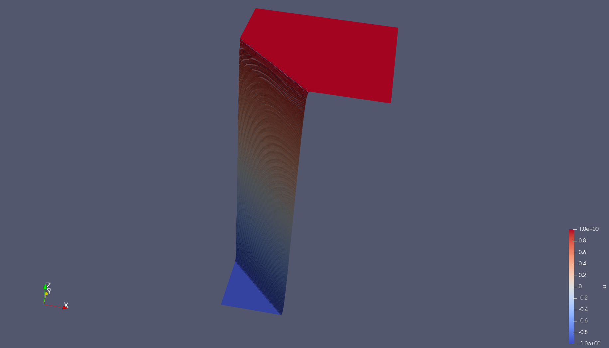
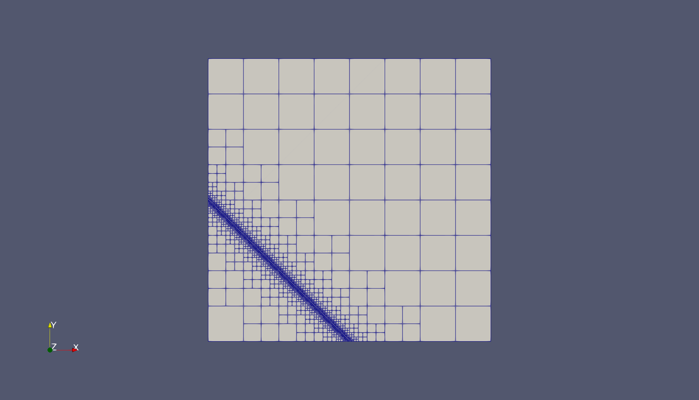

# A posteriori error estimator for first order hyperbolic problems

## Running the code:

As in the tutorial programs, type 

`cmake -DDEAL_II_DIR=/path/to/deal.II .` 

on the command line to configure the program. After that you can compile with `make` and run with either `make run` or using 

`./DG_advection_reaction`

on the command line. 

### Parameter file:

If you run `./DG_advection_reaction parameters.prm`, an error message will tell you that a parameter file has been created for you. You can open it and change some useful parameters like the number of refinement cycles, the advection coefficient, and others. If you don't specify anything, then the default values used for the test case (see paragraph below) will be used.

## The problem:
This program solves the problem, for $\Omega \in \mathbb{R^2}$

@f[
\begin{cases} b \cdot \nabla u + c u = f \qquad  \text{in } \Omega \\
\qquad \qquad u=g \qquad \text{on } \partial_{-}\Omega \end{cases}
@f]

where $g \in L^2(\partial_{-}\Omega)$ and $\partial_{-}\Omega=\{ x \in
\partial \Omega: b(x)\cdot n(x) <0\}$ is the inflow part of the
boundary, with $b=(b_1,b_2) \in \mathbb{R^2}$. As we know from
classical DG theory, we need to ensure that 
@f[
c(x) - \frac{1}{2}\nabla \cdot b \geq \gamma_0 >0
@f]
for some positive $\gamma_0$ so that we have coercivity in $L^2$ at the continuous level. Discrete coercivity is achieved by using a stronger norm which takes care of jumps, see Di Pietro and Ern [2] for details.

## The weak formulation:

As trial space we choose $V_h = \{ v_h \in L^2(\Omega): v_h \in P^1(\mathbb{T_h})\} \notin H^1(\Omega)$. If we integrate by parts and sum over all cells

@f[
\sum_{T \in \mathbb{T}_h} \Bigl( (-u,\beta \cdot \nabla v_h) _T + (c
u,v_h)_T + \bigl<(b \cdot n) u ,v_h \bigr>_{\partial T} \Bigr) =
(f,v_h)_{\Omega}
@f]

and use the so-called DG magic formula and exploit the property $[bu]_{\mathbb{F}^i} = 0$ where $\mathbb{F}^i$ are set of internal faces we obtain the (unstable!) formulation:

Find $u_h \in V_h$: 

@f[
    a_h(u_h,v_h) + b_h(u_h,v_h)=l(v_h) \qquad \forall v_h \in V_h
@f]
where
@f[
a_h(u,v_h)=\sum_{T \in \mathbb{T}_h} \Bigl( (-u,b \cdot \nabla v_h) _T + (c u,v_h)_T \Bigr)
@f]

@f[    
b_h(u,v_h)= \sum_{F \not \in \partial_{-}\Omega} \bigl< \{ bu\}, [v_h]\bigr>_F 
@f]

@f[
    l(v_h)= (f,v_h)_{\Omega} - \sum_{F \in \partial_{-}\Omega} \bigl< (b \cdot n) g,v_h \bigr>_F
@f]

It's well known this formulation is coercive only in $L^2$, hence the formulation is unstable as we don't "see" the derivatives. To stabilize this, we can use a jump-penalty term, i.e. our $b_h$ is replaced by:

@f[
b_h^s(u_h,v_h)=b_h(u_h,v_h)+ \sum_{F \in \mathbb{F}^i} \bigl< c_F
[u_h],[v_h]  \bigr> 
@f]

where $c_F>0$ is a function on each edge such that $c_F \geq \theta |b \cdot n|$ for some positive $\theta$. In this program, $\theta=\frac{1}{2}$ and $c_F = \frac{1}{2} |b \cdot n|$, which corresponds to an upwind formulation. Notice that consistency is trivially achieved, as $[u]_{\mathbb{F}^i} =0$. This formulation is stable in the energy norm 

@f[
    |||\cdot ||| = \Bigl(||\cdot||_{0,\Omega}^2 + \sum_{F \in
    \mathbb{F}}||c_F^{\frac{1}{2}}[\cdot] ||_{0,F}^2
    \Bigr)^{\frac{1}{2}}
@f]

(well defined on $H^1(\Omega) + V_h$) and moreover we have the a-priori bound:

@f[
|||u-u_h||| \leq C h^{k+\frac{1}{2}}||u||_{k+1,\Omega} 
@f]

valid for $u \in H^{k+1}(\Omega)$.

See Brezzi-Marini-Süli [3] for more details.

## A-posteriori error estimator:

The estimator is the one proposed by Georgoulis, Edward Hall and Charalambos Makridakis in [3]. This approach is quite different with respect to other works in the field, as the authors are trying to develop an estimator for the original hyperbolic problem, rather than taking the hyperbolic regime as the vanishing diffusivity limit.

The reliability is:

@f[
|||u-u_h|||^2 \leq  C || \sqrt{b \cdot n}[u_h]||_{\Gamma^{-}}^2 + C
\sum_{T \in \mathbb{T}_h}\Bigl( ||\beta (g-u_h^+)||_{\partial_{-}T
\cap \partial_{-} \Omega}^2 +||f-c u_h - \Pi(f- cu_h)||_T^2 \Bigr)
@f]

where:

- $\Pi$ is the (local) $L^2$ orthogonal projection onto $V_h$

- $\Gamma$ is the skeleton of the mesh

- $c$ is constant

- $\beta = |b \cdot n|$

- $u_h^+$ is the interior trace from the current cell $T$ of a the finite element function $u_h$.

## Test case:

The following test case has been taken from [3]. Consider:
- $c=1$ 
- $b=(1,1)$ 
- $f$ to be such that the exact solution is $u(x,y)=\tanh(100(x+y-\frac{1}{2}))$
This solution has an internal layer along the line $y=\frac{1}{2} -x$, hence we would like to see that part of the domain to be much more refined than the rest.

The next image is the 3D view of the numerical solution:

More interestingly, we see that the estimator has been able to capture the layer. Here a bulk-chasing criterion is used, with bottom fraction ´0.5´ and no coarsening. This mesh is obtained after 12 refinement cycles.

If we look at the decrease of the energy norm of the error in the globally refined case and in the adaptively case, with respect to the DoFs, we obtain:

## References 
* [1] Emmanuil H. Georgoulis, Edward Hall and Charalambos Makridakis (2013), Error Control for Discontinuous Galerkin Methods for First Order Hyperbolic Problems. DOI: [10.1007/978-3-319-01818-8_8
](https://link.springer.com/chapter/10.1007%2F978-3-319-01818-8_8)
* [2] Di Pietro, Daniele Antonio and Ern, Alexandre (2012), Mathematical Aspects of Discontinuous Galerkin Methods. ISBN: [978-3-642-22980-0](https://www.springer.com/gp/book/9783642229794)
* [3] Franco Brezzi, Luisa Donatella Marini and Endre Süli (2004) Discontinuous Galerkin Methods for First-Order Hyperbolic Problems. DOI: [10.1142/S0218202504003866](https://doi.org/10.1142/S0218202504003866)
